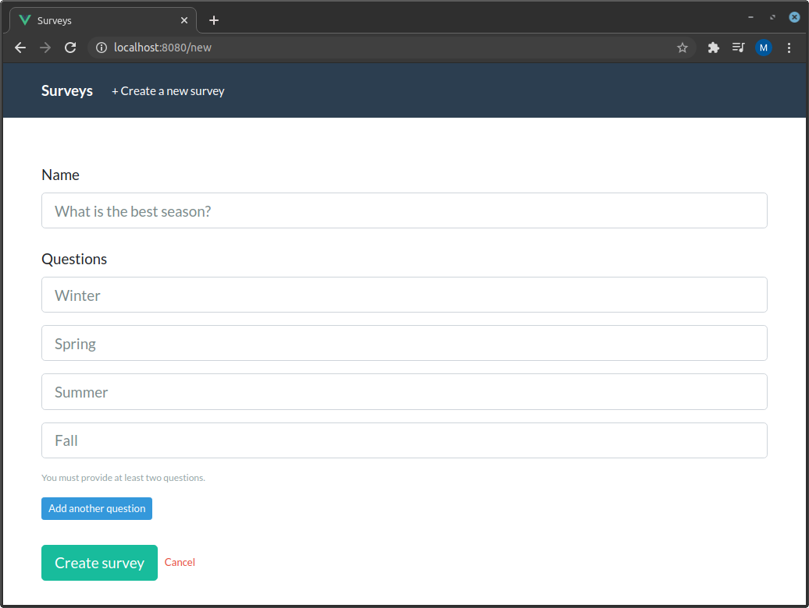
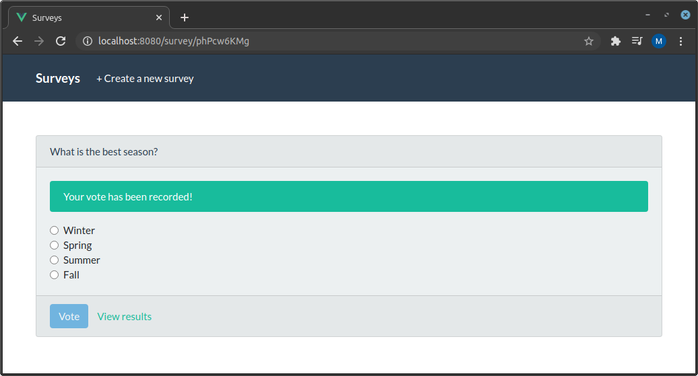
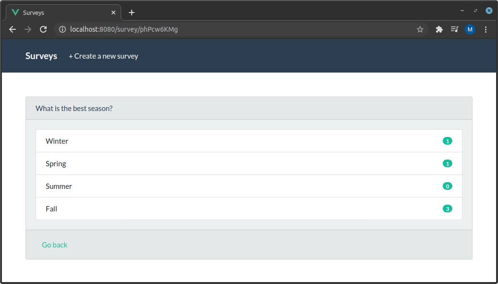

# Survey Microservice Application

This is an exercise and example of a simple distributed application composed of multiple microservices. It is not meant to be a realistic or production-ready architecture, but rather just an exploration in learning _Go_, _gRPC_ and a number of other technologies, following [hexagonal design](https://en.wikipedia.org/wiki/Hexagonal_architecture_(software)).

The end result is a web-application that allows for the creation of surveys and voting on them.

## Architecture


## Services

* **[Surveys](https://github.com/mikestefanello/surveys-microservices/tree/master/survey-service)**: Provides HTTP and gRPC APIs to create and retrieve surveys. Surveys can only be created via HTTP.
* **[Votes](https://github.com/mikestefanello/surveys-microservices/tree/master/vote-service)**: Provides an HTTP API to vote for a particular question on a survey as well as fetch results for any given survey. Votes are pushed to the queue when they are received. Results are taken from the database, which are written by the worker.
* **[Worker](https://github.com/mikestefanello/surveys-microservices/tree/master/vote-worker-service)**: Listens to the queue that votes are pushed in to and when received, writes a record of the vote to the database storage and updates the totals for each question and for each survey. The database schema is initialized with [this file](https://github.com/mikestefanello/surveys-microservices/blob/master/init/postgres/votes.sql).
* **[Frontend](https://github.com/mikestefanello/surveys-microservices/tree/master/frontend-service)**: Provides a simple, single-page application to view all surveys, create new surveys, vote, and view survey results.

## Screenshots







## Remaining tasks

* **Tests**
* Finish _README_ docs
* API documentation

## Run the app

The easiest way to run the app is to use Docker compose. Simply execute `docker-compose up -d` at the root of the repository. After the build is complete, go to `http://localhost:8080` in your browser. The survey service will listen on port 8081, and the vote service on 8082.

## Logging

Easily readable logs are provided to illustrate the requests, responses and all communication between the services. For example, using `docker-compose logs -f`, the log output looks something like:

```
surveys_1         | 2020-10-01T16:50:25Z INF COLLECTION request received
surveys_1         | 2020-10-01T16:50:33Z INF POST request received
surveys_1         | 2020-10-01T16:50:33Z INF Survey created id=Z5ptDYFGR
votes_1           | 2020-10-01T16:50:39Z INF POST request received: Vote
surveys_1         | 2020-10-01T16:50:39Z INF GetSurvey request received id=Z5ptDYFGR
vote_queue_1      | 2020-10-01 16:50:39.865 [info] <0.880.0> accepting AMQP connection <0.880.0> (172.22.0.6:58472 -> 172.22.0.2:5672)
vote_queue_1      | 2020-10-01 16:50:39.868 [info] <0.880.0> connection <0.880.0> (172.22.0.6:58472 -> 172.22.0.2:5672): user 'guest' authenticated and granted access
vote_worker_1     | 2020-10-01T16:50:39Z INF Vote received from queue id=80530e3e-7ae9-4b25-9ec8-7fd4c665a75f
votes_1           | 2020-10-01T16:50:39Z INF Vote created id=80530e3e-7ae9-4b25-9ec8-7fd4c665a75f
vote_queue_1      | 2020-10-01 16:50:39.870 [info] <0.880.0> closing AMQP connection <0.880.0> (172.22.0.6:58472 -> 172.22.0.2:5672, vhost: '/', user: 'guest')
vote_worker_1     | 2020-10-01T16:50:39Z INF Vote stored id=80530e3e-7ae9-4b25-9ec8-7fd4c665a75f
vote_worker_1     | 2020-10-01T16:50:39Z INF Vote added to results id=80530e3e-7ae9-4b25-9ec8-7fd4c665a75f
```

## Configuration

(todo)

## Notes

There is currently no user authentication or limits placed on the amount of votes a client can make on any surveys. Surveys and votes cannot be changed or deleted.

## Credits

* [chi](https://github.com/go-chi/chi)
* [validator](https://github.com/go-playground/validator)
* [zerolog](https://github.com/rs/zerolog)
* [shortid](https://github.com/teris-io/shortid)
* [envdecode](https://github.com/joeshaw/envdecode)
* [mongo-go-driver](https://github.com/mongodb/mongo-go-driver)
* [grpc](https://pkg.go.dev/google.golang.org/grpc)
* [go.uuid](https://github.com/satori/go.uuid)
* [amqp](https://github.com/streadway/amqp)
* [pgx](https://github.com/jackc/pgx)
* [bootswatch](https://github.com/thomaspark/bootswatch)