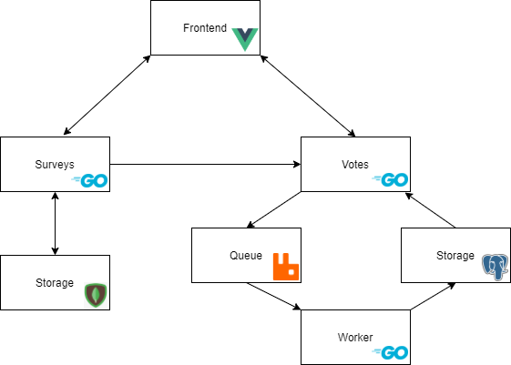

# Survey Microservice Application

**(Work in progress)**

This is an exercise and example of a simple distributed application composed of multiple microservices. It is not meant to be a realistic or production-ready architecture, but rather just an exploration in learning _Go_, _gRPC_ and a number of other technologies, following [hexagonal design](https://en.wikipedia.org/wiki/Hexagonal_architecture_(software)).

The end result is a web-application that allows for the creation of surveys and voting on them.

## Architecture

## Remaining tasks

* Frontend service
* Containerize Go apps
* Tests
* README docs
* API documentation
* Refactoring

## Run the app

(todo)

## Configuration

(todo)

## Notes

There is currently no user authentication or limits placed on the amount of votes a client can make on any surveys. Surveys and votes cannot be changed or deleted.

## Credits

* [chi](https://github.com/go-chi/chi)
* [validator](https://github.com/go-playground/validator)
* [zerolog](https://github.com/rs/zerolog)
* [shortid](https://github.com/teris-io/shortid)
* [envdecode](https://github.com/joeshaw/envdecode)
* [mongo-go-driver](https://github.com/mongodb/mongo-go-driver)
* [grpc](https://pkg.go.dev/google.golang.org/grpc)
* [go.uuid](https://github.com/satori/go.uuid)
* [amqp](https://github.com/streadway/amqp)
* [pgx](https://github.com/jackc/pgx)